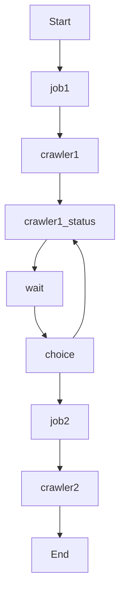
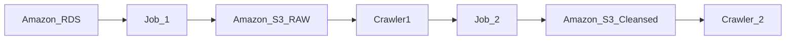
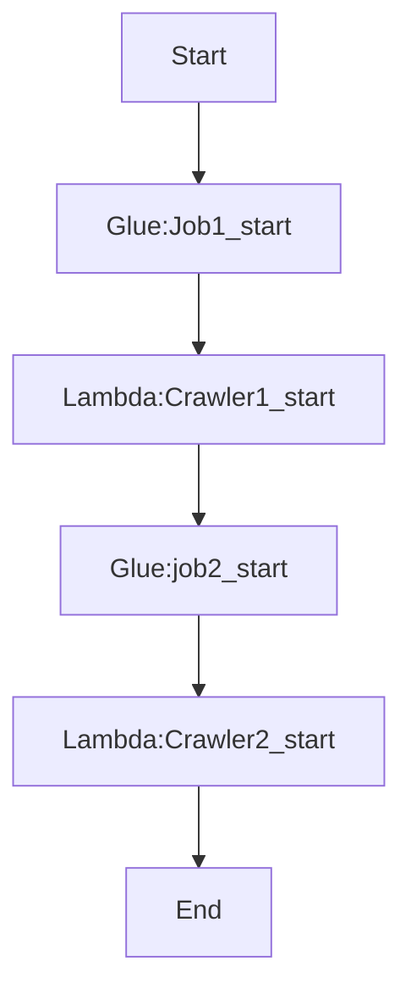
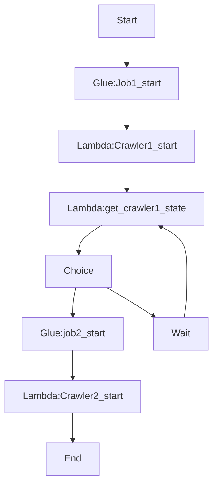

# Building ETL pipeline using AWS Glue and Step Function:

---

There are 3 ways in creating the pipelines:

- Event - Based Framework:
  
  - The services used for this process are:
    
    - AWS Lambda
    
    - AWS Cloud Watch
    
    - AWS Dynamo DB
    
    - AWS Event Bridge

- Glue Workflow:
  
  - The services used for this process are:
    
    - AWS Glue

- **Step Functions**:
  
  - The services used for this process are:
    
    - AWS Step Functions

---

We will be running some glue jobs for the data manipulation and data storage.

Also we will running some crawlers that are responsible for the cataloging the data and complete the pipeline.



---

### Procedure:

1. Setting a Glue Job:
   
   - we need to give some parameter for the job which involves: 
     
     - Job Name
     
     - Job parameters
   
   - we need to set the Job execution to be a Synchronous or Asynchronous run.
   
   - Once the Job is done Successfully we need to specify the next step which is called as the `State`

2. Setting a Glue Crawler:
   
   - The execution is a long running process, which depends on the size of the data.
   
   - We will using 2 lambda functions for this:
     
     - Function 1 : `Start Crawler`
     
     - Function 2:  `Get Status of the Crawler`

```python
# Python Lambda function to start the Crawler
import json
import boto3

def lambda_handler(event, context):
    target = event["crawlername"]
    gclient = boto3.client('glue')
    gclient.start_crawler(Name=target)
    # return runid or return None
```

```python
# python lambda funtion to get the status of the Crawler

import json
import boto3

def lambda_handler(event, context):
    target = event["crawlername"]
    gclient = boto3.client('glue')
    response = gclient.get_crawler(Name = target)
    return {
        'state': response['Crawler']['State']
    }
```

---

### Working Demo Flow:



1. I have the Customers Table in RDS service, we will be creating a Job to populate the data into S3 in the raw format.

2. we will be using a crawler creates a new job to get the data from the S3 and cleanse it to create the new Crawler.

---

### Building the pipeline:

1. Now we have a S3 bucket with name `etl-pipeline` which has folders:
   
   - Cleansed
   
   - Raw
   
   - Scripts

2. In the AWS Glue Tables i have the `Customers` table saved and we are going to use that table.
   
   - How did we get the Customers data?
     
     - we have created a Crawler, `Source_Crawler` which will get the data from the RDS data base and save them in the Customers table in AWS Glue.

3- We have also created 2 more Crawlers called `crawler1` and `crawler2`

- The first crawler is responsible for getting the raw data and creates a table called `raw_customers`

- The second crawler is responsible for getting the cleansed data and creates a table called `cleansed_customers`
4. Also we have created `Jobs` 
   
   - `Job1` is created to get the data from the Database in Glue and save that to the S3 bucket in the Raw folder with the csv format.
   -  `Job2` is created to get the data from the Database in Glue and save that to the S3 bucket in the Cleansed folder with the parquet format.

```python
# job 1
import sys
from awsglue.transforms import *
from awsglue.utils import getResolvedOptions
from pyspark.context import SparkContent
from awsglue.context import GlueContext
from awsglue.job import Job

glueContext = GlueContext(SparkContext.getOrCreate())
customerDF = glueContext.create_dynamic_frame.from_catalog(
    database = "mydatabase", # dbname in glue
    table_name = "Customers",
    redshift_tmp_dir = "s3://etl-pipeline/Scripts/")


glueContext.write_dynamic_frame.from_options(
    customerDF,
    connection_type = "s3",
    connections_options = {"path": "s3://etl-pipeline/raw/customers" },
    format = "csv")
```

```python
# job2
import sys
from awsglue.transform import *
from awsglue.utils import getResolvedOptions
from pyspark.context import Sparkcontext
from awsglue.context import GlueContext
from awsglue.job import Job


glueContext = GlueContext(SparkContext.getOrCreate())

customerDF = glueContext.create_dynamic_frame.from_catalog(
    database = "mydatabase", # dbname in glue
    table_name = "raw_Customers")


glueContext.write_dynamic_frame.from_options(
    customerDF,
    connection_type = "s3",
    connections_options = {"path": "s3://etl-pipeline/Cleansed/customers" },
    format = "parquet")
```

---

### State Machines in Step Function Service:

we need to create anew workflow for this ETL pipeline. We will be creating this workflow using the designer since it is very easy to create.

The start and End states are already mentioned when you have created a new workflow.



**Configuration for job1_start:**

API parameters:

> {
> 
>     "JobName": "job1"
> 
> }

- [x] Wait for the task to complete

check the above box, so that the workflow is maintained to be in synchronous format.


**Configuration for job2_start:**

API parameters:

> {
> 
>     "JobName": "job2"
> 
> }

- [x] Wait for the task to complete

check the above box, so that the workflow is maintained to be in synchronous format.


**Configuration for crawler1_start:**

API Parameters: we need to provide the Lambda function name which we are going to use for starting the crawler. In our case it is `Function1` which is mentioned in the starting of this article.

Payload:

> {
> 
>     "crawlername" : "crawler1"
> 
> }


**Configuration for crawler2_start:**

API Parameters: we need to provide the Lambda function name which we are going to use for starting the crawler. In our case it is `Function1` which is mentioned in the starting of this article.

Payload:

> {
> 
>     "crawlername" : "crawler2"
> 
> }


Now that the flow will be working fine, but it should wait until the job gets created right. so we need to check the status of the crawler and then move to then step in the flow




**Configuration for get_crawler1_status:**

API parameters: we need to provide the Lambda function name which we are going to use for starting the crawler. In our case it is `Function2` which is mentioned in the starting of this article. The function2 gets the status of the Crawler whether it is ready or not ready.

Payload:

> {
> 
>     "crawlername" : "crawler1"
> 
> }


**Configuration for the Choice:**

The default rule is the normal usecase, that is it should go to the next Job once it is done. if the Job is not done again it should go back to the get_crawler1_state to get the status of the Crawler. to check that we will be using the Choice rules.

In the rules we will be adding a condition:

> not ($.state == "READY")

And then set the next state to be:  `Wait` for 3 seconds or 5 seconds and then move to `get_crawler1_state`.

Save the workflow and start the execution.
